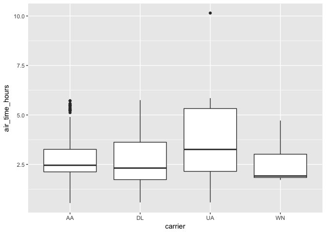

Flights Data
------------

This guide will demonstrate some of the basic data manipulation verbs of dplyr by using data from the `nycflights13` R package. This package contains data for all 336,776 flights departing New York City in 2013. It also includes useful metadata on airlines, airports, weather, and planes. The data comes from the US [Bureau of Transportation Statistics](http://www.transtats.bts.gov/DatabaseInfo.asp?DB_ID=120&Link=0), and is documented in `?nycflights13`

### Connect and load data

Run the following block to connect to the cluster and copy the flights data using the `copy_to` function.

**Caveat:** The flight data in `nycflights13` is convenient for dplyr demonstrations because it is small, but in practice large data should rarely be copied directly from R objects.

``` r
sc <- spark_connect(master = "local", version = "2.0.0", hadoop_version="2.7")
flights_tbl <- spark_read_parquet(sc, "flights", "datainputs/nycflights13-parquet/flights")
airlines_tbl <- copy_to(sc, airlines, "airlines", overwrite = TRUE)

src_tbls(sc)
```

    ## [1] "airlines" "flights"

### dplyr Verbs

Verbs are dplyr commands for manipulating data. When connected to a Spark DataFrame, dplyr translates the commands into Spark SQL statements. Remote data sources use exactly the same five verbs as local data sources. Here are the five verbs with their corresponding SQL commands:

-   `select` ~ `SELECT`
-   `filter` ~ `WHERE`
-   `arrange` ~ `ORDER`
-   `summarise` ~ `aggregators: sum, min, sd, etc.`
-   `mutate` ~ `operators: +, *, log, etc.`

Run the following block to see what all these commands do in Spark.

``` r
select(flights_tbl, year:day, arr_delay, dep_delay)
```

    ## Source:   query [3.368e+05 x 5]
    ## Database: spark connection master=local[4] app=sparklyr local=TRUE
    ## 
    ##     year month   day arr_delay dep_delay
    ##    <int> <int> <int>     <dbl>     <dbl>
    ## 1   2013     4    26       -32       -10
    ## 2   2013     4    26        19        21
    ## 3   2013     4    26       -52        -7
    ## 4   2013     4    26        -2        -4
    ## 5   2013     4    26        -2        10
    ## 6   2013     4    26        38        14
    ## 7   2013     4    26        33        11
    ## 8   2013     4    26        72        44
    ## 9   2013     4    26       -18        -5
    ## 10  2013     4    26         2        -4
    ## # ... with 3.368e+05 more rows

``` r
filter(flights_tbl, dep_delay > 1000)
```

    ## Source:   query [5 x 19]
    ## Database: spark connection master=local[4] app=sparklyr local=TRUE
    ## 
    ##    year month   day dep_time sched_dep_time dep_delay arr_time
    ##   <int> <int> <int>    <int>          <int>     <dbl>    <int>
    ## 1  2013     6    15     1432           1935      1137     1607
    ## 2  2013     7    22      845           1600      1005     1044
    ## 3  2013     1     9      641            900      1301     1242
    ## 4  2013     1    10     1121           1635      1126     1239
    ## 5  2013     9    20     1139           1845      1014     1457
    ## # ... with 12 more variables: sched_arr_time <int>, arr_delay <dbl>,
    ## #   carrier <chr>, flight <int>, tailnum <chr>, origin <chr>, dest <chr>,
    ## #   air_time <dbl>, distance <dbl>, hour <dbl>, minute <dbl>,
    ## #   time_hour <dbl>

``` r
arrange(flights_tbl, desc(dep_delay))
```

    ## Source:   query [3.368e+05 x 19]
    ## Database: spark connection master=local[4] app=sparklyr local=TRUE
    ## 
    ##     year month   day dep_time sched_dep_time dep_delay arr_time
    ##    <int> <int> <int>    <int>          <int>     <dbl>    <int>
    ## 1   2013     1     9      641            900      1301     1242
    ## 2   2013     6    15     1432           1935      1137     1607
    ## 3   2013     1    10     1121           1635      1126     1239
    ## 4   2013     9    20     1139           1845      1014     1457
    ## 5   2013     7    22      845           1600      1005     1044
    ## 6   2013     4    10     1100           1900       960     1342
    ## 7   2013     3    17     2321            810       911      135
    ## 8   2013     6    27      959           1900       899     1236
    ## 9   2013     7    22     2257            759       898      121
    ## 10  2013    12     5      756           1700       896     1058
    ## # ... with 3.368e+05 more rows, and 12 more variables:
    ## #   sched_arr_time <int>, arr_delay <dbl>, carrier <chr>, flight <int>,
    ## #   tailnum <chr>, origin <chr>, dest <chr>, air_time <dbl>,
    ## #   distance <dbl>, hour <dbl>, minute <dbl>, time_hour <dbl>

``` r
summarise(flights_tbl, mean_dep_delay = mean(dep_delay))
```

    ## Source:   query [1 x 1]
    ## Database: spark connection master=local[4] app=sparklyr local=TRUE
    ## 
    ##   mean_dep_delay
    ##            <dbl>
    ## 1       12.63907

``` r
mutate(flights_tbl, speed = distance / air_time * 60)
```

    ## Source:   query [3.368e+05 x 20]
    ## Database: spark connection master=local[4] app=sparklyr local=TRUE
    ## 
    ##     year month   day dep_time sched_dep_time dep_delay arr_time
    ##    <int> <int> <int>    <int>          <int>     <dbl>    <int>
    ## 1   2013     4    26     1420           1430       -10     1557
    ## 2   2013     4    26     1420           1359        21     1613
    ## 3   2013     4    26     1423           1430        -7     1753
    ## 4   2013     4    26     1425           1429        -4     1741
    ## 5   2013     4    26     1425           1415        10     1525
    ## 6   2013     4    26     1426           1412        14     1713
    ## 7   2013     4    26     1426           1415        11     1628
    ## 8   2013     4    26     1429           1345        44     1617
    ## 9   2013     4    26     1430           1435        -5     1553
    ## 10  2013     4    26     1431           1435        -4     1646
    ## # ... with 3.368e+05 more rows, and 13 more variables:
    ## #   sched_arr_time <int>, arr_delay <dbl>, carrier <chr>, flight <int>,
    ## #   tailnum <chr>, origin <chr>, dest <chr>, air_time <dbl>,
    ## #   distance <dbl>, hour <dbl>, minute <dbl>, time_hour <dbl>, speed <dbl>

### Preprocess

Use filter, select, arrange, and mutate to subset the flights data.

Fill in the ??? in the pipe below to get the departure delay, air time (in hours) and distance of all flights from the carriers United (UA), Southwest (WN), American (AA) and Delta (DL) on May 17. Arrange the results by carrier. Note that the air time as reported in column `air_time` is in minutes.

``` r
c4  <- flights_tbl %>%
  filter(month == 5, day == 17, carrier %in% c('UA', 'WN', 'AA', 'DL')) %>%
  select(carrier, dep_delay, air_time, distance) %>%
  arrange(carrier) %>%
  mutate(air_time_hours = air_time / 60) %>%
  compute()  # this last command forces the computation and saves the result in the remote store
```

### Grouping

Used alone, the `group_by` function corresponds to the `GROUP BY` statement in SQL.

Fill in the ??? to count the number of flights and the mean departure delay by carrier. Hint: the dplyr aggregation function `n()` counts rows and respects groups.

``` r
c4 %>%
  group_by(carrier) %>%
  summarize(count = n(), mean_dep_delay = mean(dep_delay)) 
```

    ## Source:   query [4 x 3]
    ## Database: spark connection master=local[4] app=sparklyr local=TRUE
    ## 
    ##   carrier count mean_dep_delay
    ##     <chr> <dbl>          <dbl>
    ## 1      AA    94       1.468085
    ## 2      DL   136       6.235294
    ## 3      UA   172       9.633721
    ## 4      WN    34       7.970588

### Collecting to R : Example use

You can copy data from Spark into R's memory by using `collect()`. `collect()` executes the Spark query and returns the results to R for further analysis and visualization.

Run this block to see an example. Notice `carrierhours` is a local tbl.

``` r
carrierhours <- collect(c4)

# Test the significance of pairwise differences and plot the results
with(carrierhours, pairwise.t.test(air_time, carrier))
```

    ## 
    ##  Pairwise comparisons using t tests with pooled SD 
    ## 
    ## data:  air_time and carrier 
    ## 
    ##    AA      DL      UA     
    ## DL 0.25057 -       -      
    ## UA 0.07957 0.00044 -      
    ## WN 0.07957 0.23488 0.00041
    ## 
    ## P value adjustment method: holm

``` r
ggplot(carrierhours, aes(carrier, air_time_hours)) + geom_boxplot()
```



### Spark Window Functions

dplyr implements grouped operations using Spark SQL window functions. You can compare the dplyr syntax to the query it has generated by using `show_query()` (note: this is very related to `sql_render()`).

Both the below commands use window functions, indicated by the word `PARTITION` in the SQL. Find out which dplyr step needs window functions, by running of the pipe and looking at the SQL.

``` r
# Find the most and least delayed flight each day
bestworst <- flights_tbl %>%
  group_by(year, month, day) %>%
  select(dep_delay) %>% 
  filter(dep_delay == min(dep_delay) || dep_delay == max(dep_delay))
show_query(bestworst)
## <SQL>
## SELECT `year`, `month`, `day`, `dep_delay`
## FROM (SELECT `year`, `month`, `day`, `dep_delay`, min(`dep_delay`) OVER (PARTITION BY `year`, `month`, `day`) AS `zzz4`, max(`dep_delay`) OVER (PARTITION BY `year`, `month`, `day`) AS `zzz5`
## FROM (SELECT `year` AS `year`, `month` AS `month`, `day` AS `day`, `dep_delay` AS `dep_delay`
## FROM `flights`) `ocnwxrqkac`) `lbyorgahok`
## WHERE (`dep_delay` = `zzz4` OR `dep_delay` = `zzz5`)
bestworst
## Source:   query [824 x 4]
## Database: spark connection master=local[4] app=sparklyr local=TRUE
## Groups: year, month, day
## 
##     year month   day dep_delay
##    <int> <int> <int>     <dbl>
## 1   2013     1     1       853
## 2   2013     1     1       -15
## 3   2013     1     1       -15
## 4   2013     1     9      1301
## 5   2013     1     9       -17
## 6   2013     1    14       -20
## 7   2013     1    14       334
## 8   2013     1    23       -18
## 9   2013     1    23       478
## 10  2013     1    24       -15
## # ... with 814 more rows
```

``` r
# Rank each flight within a daily
ranked <- flights_tbl %>%
  group_by(year, month, day) %>%
  select(dep_delay) %>% 
  mutate(rank = rank(desc(dep_delay)))
show_query(ranked)
```

    ## <SQL>
    ## SELECT `year`, `month`, `day`, `dep_delay`, rank() OVER (PARTITION BY `year`, `month`, `day` ORDER BY `dep_delay` DESC) AS `rank`
    ## FROM (SELECT `year` AS `year`, `month` AS `month`, `day` AS `day`, `dep_delay` AS `dep_delay`
    ## FROM `flights`) `cdwmfskipm`

``` r
ranked
```

    ## Source:   query [3.368e+05 x 5]
    ## Database: spark connection master=local[4] app=sparklyr local=TRUE
    ## Groups: year, month, day
    ## 
    ##     year month   day dep_delay  rank
    ##    <int> <int> <int>     <dbl> <int>
    ## 1   2013     1     1       853     1
    ## 2   2013     1     1       379     2
    ## 3   2013     1     1       290     3
    ## 4   2013     1     1       285     4
    ## 5   2013     1     1       260     5
    ## 6   2013     1     1       255     6
    ## 7   2013     1     1       216     7
    ## 8   2013     1     1       192     8
    ## 9   2013     1     1       157     9
    ## 10  2013     1     1       155    10
    ## # ... with 3.368e+05 more rows

### Sampling

You can use `sdf_sample` to take a random sample of rows.

Run the block below and compare the size of the sample to the size of the original flights\_tbl (Please use summarize to find the row count, as not all remote data services implement nrow(). Spark does, but you can't always count on it).

``` r
fsample <- sdf_sample(flights_tbl, 0.01)
```

### Writing Data

It is often useful to save the results of your analysis or the tables that you have generated on your Spark cluster into persistent storage. The best option in many scenarios is to write the table out to a [Parquet](https://parquet.apache.org/) file using the [spark\_write\_parquet](reference/sparklyr/spark_write_parquet.html) function. For example:

-   `spark_write_parquet` Writes a Parquet file
-   `spark_write_csv` Writes a CSV file
-   `spark_write_json` Writes a JSON file

``` r
spark_write_parquet(flights_tbl, "data/nycflights13-parquet/flights", mode = "overwrite")
spark_write_parquet(airlines_tbl, "data/nycflights13-parquet/airlines", mode = "overwrite")
```

### Reading Data

You can read data into Spark DataFrames using the following functions:

-   `spark_read_csv` Reads a CSV file and provides a data source compatible with dplyr
-   `spark_read_json` Reads a JSON file and provides a data source compatible with dplyr
-   `spark_read_parquet` Reads a parquet file and provides a data source compatible with dplyr

Regardless of the format of your data, Spark supports reading data from a variety of different data sources. These include data stored on HDFS (`hdfs://` protocol), Amazon S3 (`s3n://` protocol), or local files available to the Spark worker nodes (`file://` protocol)

Each of these functions returns a reference to a Spark DataFrame which can be used as a dplyr table (`tbl`).

This will write the Spark DataFrame referenced by the tbl R variable to the given HDFS path. You can use the [spark\_read\_parquet](reference/sparklyr/spark_read_parquet.html) function to read the same table back into a subsequent Spark session:

``` r
spark_read_parquet(sc, "data", "data/nycflights13-parquet/flights")
```

    ## Source:   query [3.368e+05 x 19]
    ## Database: spark connection master=local[4] app=sparklyr local=TRUE
    ## 
    ##     year month   day dep_time sched_dep_time dep_delay arr_time
    ##    <int> <int> <int>    <int>          <int>     <dbl>    <int>
    ## 1   2013     4    26     1420           1430       -10     1557
    ## 2   2013     4    26     1420           1359        21     1613
    ## 3   2013     4    26     1423           1430        -7     1753
    ## 4   2013     4    26     1425           1429        -4     1741
    ## 5   2013     4    26     1425           1415        10     1525
    ## 6   2013     4    26     1426           1412        14     1713
    ## 7   2013     4    26     1426           1415        11     1628
    ## 8   2013     4    26     1429           1345        44     1617
    ## 9   2013     4    26     1430           1435        -5     1553
    ## 10  2013     4    26     1431           1435        -4     1646
    ## # ... with 3.368e+05 more rows, and 12 more variables:
    ## #   sched_arr_time <int>, arr_delay <dbl>, carrier <chr>, flight <int>,
    ## #   tailnum <chr>, origin <chr>, dest <chr>, air_time <dbl>,
    ## #   distance <dbl>, hour <dbl>, minute <dbl>, time_hour <dbl>
