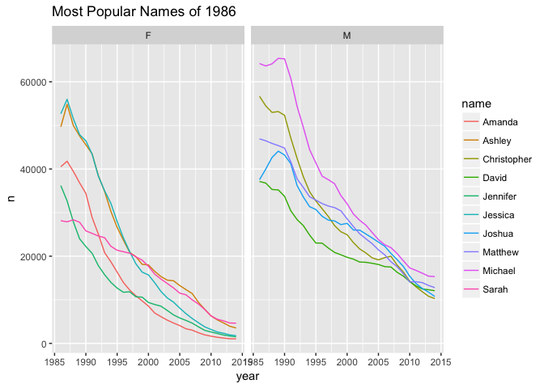

Use dplyr syntax to write Apache Spark SQL queries. Use select, where, group by, joins, and window functions in Aparche Spark SQL.

Setup
-----

``` r
knitr::opts_chunk$set(warning = FALSE, message = FALSE)
library(sparklyr)
library(dplyr)
```

    ## 
    ## Attaching package: 'dplyr'

    ## The following objects are masked from 'package:stats':
    ## 
    ##     filter, lag

    ## The following objects are masked from 'package:base':
    ## 
    ##     intersect, setdiff, setequal, union

``` r
library(tidyr)
library(babynames)
library(ggplot2)
library(dygraphs)
library(rbokeh)
```

Connect to Spark
----------------

Install and connect to a local Spark instance. Copy data into Spark DataFrames.

``` r
sc <- spark_connect(master = "local", version = "2.0.0")
babynames_tbl <- copy_to(sc, babynames, "babynames", overwrite = TRUE)
applicants_tbl <- copy_to(sc, applicants, "applicants", overwrite = TRUE)
```

Total US births
---------------

Plot total US births recorded from the Social Security Administration.

First, for practice, do it locally in the applicants data frame, and tidyr::spread

``` r
# local approach
birthsYearly <- applicants %>%  
  mutate(n_all = n_all/1000000) %>%
  tidyr::spread(sex, n_all)

# try it with remote data. Oops! This fails at tidyr::spread
birthsYearly <- applicants_tbl %>%  
  mutate(n_all = n_all/1000000) %>%
  tidyr::spread(sex, n_all)
```

    ## Error: Key column 'sex' does not exist in input.

Now simulate `tidyr::spread` on the remote data, and continue.

``` r
# brutal, by-hand spread on remote data
birthsYearly <- applicants_tbl %>%
  mutate(male = ifelse(sex == "M", n_all, 0), female = ifelse(sex == "F", n_all, 0)) %>%
  group_by(year) %>%
  summarize(Male = sum(male) / 1000000, Female = sum(female) / 1000000) %>%
  arrange(year) %>%
  collect

# plot it
birthsYearly %>%
  dygraph(main = "Total US Births (SSN)", ylab = "Millions") %>%
  dySeries("Female") %>%
  dySeries("Male") %>%
  dyOptions(stackedGraph = TRUE) %>%
  dyRangeSelector(height = 20) 
```

<!--html_preserve-->

<script type="application/json" data-for="htmlwidget-8210bf8221a03efa547f">{"x":{"attrs":{"title":"Total US Births (SSN)","ylabel":"Millions","labels":["year","Female","Male"],"legend":"auto","retainDateWindow":false,"axes":{"x":{"pixelsPerLabel":60,"drawAxis":true},"y":{"drawAxis":true}},"series":{"Female":{"axis":"y"},"Male":{"axis":"y"}},"stackedGraph":true,"fillGraph":false,"fillAlpha":0.15,"stepPlot":false,"drawPoints":false,"pointSize":1,"drawGapEdgePoints":false,"connectSeparatedPoints":false,"strokeWidth":1,"strokeBorderColor":"white","colorValue":0.5,"colorSaturation":1,"includeZero":false,"drawAxesAtZero":false,"logscale":false,"axisTickSize":3,"axisLineColor":"black","axisLineWidth":0.3,"axisLabelColor":"black","axisLabelFontSize":14,"axisLabelWidth":60,"drawGrid":true,"gridLineWidth":0.3,"rightGap":5,"digitsAfterDecimal":2,"labelsKMB":false,"labelsKMG2":false,"labelsUTC":false,"maxNumberWidth":6,"animatedZooms":false,"mobileDisableYTouch":true,"showRangeSelector":true,"rangeSelectorHeight":20,"rangeSelectorPlotFillColor":" #A7B1C4","rangeSelectorPlotStrokeColor":"#808FAB","interactionModel":"Dygraph.Interaction.defaultModel"},"annotations":[],"shadings":[],"events":[],"format":"numeric","data":[[1880,1881,1882,1883,1884,1885,1886,1887,1888,1889,1890,1891,1892,1893,1894,1895,1896,1897,1898,1899,1900,1901,1902,1903,1904,1905,1906,1907,1908,1909,1910,1911,1912,1913,1914,1915,1916,1917,1918,1919,1920,1921,1922,1923,1924,1925,1926,1927,1928,1929,1930,1931,1932,1933,1934,1935,1936,1937,1938,1939,1940,1941,1942,1943,1944,1945,1946,1947,1948,1949,1950,1951,1952,1953,1954,1955,1956,1957,1958,1959,1960,1961,1962,1963,1964,1965,1966,1967,1968,1969,1970,1971,1972,1973,1974,1975,1976,1977,1978,1979,1980,1981,1982,1983,1984,1985,1986,1987,1988,1989,1990,1991,1992,1993,1994,1995,1996,1997,1998,1999,2000,2001,2002,2003,2004,2005,2006,2007,2008,2009,2010,2011,2012,2013,2014],[0.097605,0.098856,0.115698,0.120064,0.137588,0.14195,0.153738,0.155423,0.18945,0.189219,0.201662,0.196567,0.22492,0.225233,0.235972,0.247109,0.251995,0.248277,0.274146,0.24749,0.317787,0.254234,0.280336,0.278199,0.292438,0.309873,0.31344,0.337435,0.354531,0.368094,0.419524,0.441807,0.586697,0.654885,0.796598,1.023881,1.085704,1.12369,1.202364,1.174652,1.244037,1.27966,1.2475,1.252425,1.295689,1.263027,1.230067,1.236317,1.195356,1.157432,1.166295,1.103512,1.106142,1.045823,1.082153,1.086646,1.077378,1.101717,1.141298,1.133961,1.18118,1.245784,1.390336,1.4352,1.366399,1.346065,1.612797,1.817768,1.742595,1.755489,1.758654,1.846411,1.90239,1.928519,1.990684,2.004327,2.059322,2.097447,2.064945,2.078458,2.07989,2.076097,2.02695,1.987851,1.957088,1.827275,1.755492,1.716573,1.709406,1.762654,1.831855,1.752253,1.612465,1.553987,1.566101,1.560636,1.571829,1.644785,1.643634,1.722968,1.780088,1.787868,1.813555,1.788979,1.802422,1.845465,1.844596,1.87348,1.922098,1.991706,2.053591,2.032918,2.004098,1.970884,1.948755,1.920947,1.916548,1.9084,1.93754,1.945669,1.994317,1.979408,1.973374,2.004775,2.015813,2.027235,2.087917,2.113528,2.079498,2.021228,1.956103,1.932372,1.932633,1.91857,1.938534],[0.1184,0.108284,0.122033,0.11248,0.122741,0.115947,0.119041,0.109314,0.129908,0.119036,0.119701,0.10927,0.131454,0.12104,0.124896,0.126646,0.129074,0.121943,0.132107,0.115196,0.162149,0.115597,0.132749,0.129327,0.138508,0.143245,0.144072,0.158591,0.166374,0.176867,0.208526,0.241392,0.451455,0.536242,0.683318,0.880948,0.923264,0.959332,1.048705,1.01535,1.100888,1.137937,1.125314,1.132332,1.169036,1.151459,1.145447,1.16169,1.14107,1.107325,1.12931,1.069263,1.074098,1.019806,1.061617,1.069222,1.06407,1.093337,1.136186,1.133021,1.185937,1.254527,1.407983,1.45419,1.388854,1.371277,1.650055,1.85728,1.782603,1.801886,1.819204,1.909951,1.973924,1.999744,2.067731,2.088519,2.144599,2.187562,2.153055,2.166401,2.166051,2.155792,2.102331,2.065422,2.027525,1.895641,1.818122,1.780016,1.776351,1.830469,1.905936,1.818527,1.674828,1.614289,1.630824,1.623099,1.633238,1.709746,1.708835,1.791531,1.854471,1.861885,1.886438,1.862569,1.875548,1.923143,1.920287,1.948912,2.000688,2.095117,2.150729,2.118913,2.09832,2.064714,2.037618,2.010619,2.002931,1.996839,2.026625,2.03774,2.086814,2.06684,2.065032,2.099439,2.111466,2.1251,2.189783,2.212144,2.176932,2.117127,2.049975,2.02581,2.022025,2.010997,2.029795]],"fixedtz":false,"tzone":""},"evals":["attrs.interactionModel"],"jsHooks":[]}</script>
<!--/html_preserve-->
Aggregate data by name
----------------------

Use Spark SQL to create a look up table.

``` r
topNames_tbl <- babynames_tbl %>%
  filter(year >= 1986) %>%  
  group_by(name, sex) %>%
  summarize(count = sum(n)) %>%
  filter(count > 1000) %>%
  select(name, sex) %>%
  compute

yearlyNames_tbl <- babynames_tbl %>%
  filter(year >= 1986) %>%
  inner_join(topNames_tbl, by = c("sex", "name")) %>%
  compute
```

Most popular names (1986)
-------------------------

Identify the top 5 male and female names from 1986. Visualize the popularity trend over time.

``` r
topNames1986_tbl <- yearlyNames_tbl %>%
  filter(year == 1986) %>%
  group_by(sex) %>%
  mutate(rank = min_rank(desc(n))) %>%
  filter(rank <= 5) %>%
  arrange(sex, rank) %>%
  select(name, sex, rank) %>%
  compute


topNames1986Yearly <- yearlyNames_tbl %>%
  inner_join(topNames1986_tbl, by = c("sex", "name")) %>%
  collect

ggplot(topNames1986Yearly, aes(year, n, color=name)) +
  facet_grid(~sex) +
  geom_line() +
  ggtitle("Most Popular Names of 1986")
```



Shared names
------------

Visualize the most popular names that are shared by both males and females.

``` r
sharedName <- babynames_tbl %>%
  mutate(male = ifelse(sex == "M", n, 0), female = ifelse(sex == "F", n, 0)) %>%
  group_by(name) %>%
  summarize(Male = as.numeric(sum(male)), 
            Female = as.numeric(sum(female)),
            count = sum(n),
            AvgYear = round(as.numeric(sum(year * n) / sum(n)),0)) %>%
  filter(Male > 30000 & Female > 30000) %>%
  collect

figure(width = NULL, height = NULL, 
       xlab = "Log10 Number of Males", 
       ylab = "Log10 Number of Females",
       title = "Top shared names (1880 - 2014)") %>%
  ly_points(log10(Male), log10(Female), data = sharedName,
            color = AvgYear, size = scale(sqrt(count)),
            hover = list(name, Male, Female, AvgYear), legend = FALSE)
```

<!--html_preserve-->

<script type="application/json" data-for="htmlwidget-295599f42d4a671a2477">{"x":{"elementid":"7cdcc140239f41c91ac04a13c25f999d","modeltype":"Plot","modelid":"50efeaafc7b580ca2bf143ddbad50b2c","docid":"1789fd3bb0dcf80890279eec139ff114","docs_json":{"1789fd3bb0dcf80890279eec139ff114":{"version":"0.12.2","title":"Bokeh Figure","roots":{"root_ids":["50efeaafc7b580ca2bf143ddbad50b2c"],"references":[{"type":"Plot","id":"50efeaafc7b580ca2bf143ddbad50b2c","attributes":{"id":"50efeaafc7b580ca2bf143ddbad50b2c","sizing_mode":"scale_both","x_range":{"type":"Range1d","id":"aa4c8fd3da9b2a51606c679f1ec8c7f8"},"y_range":{"type":"Range1d","id":"92f98359e40609df5a7d1aa00ba5374e"},"left":[{"type":"LinearAxis","id":"6ef88fa4ec5210db15549821cd396165"}],"below":[{"type":"LinearAxis","id":"817907d2395d7fad2b6a3f854c7aa292"}],"right":[],"above":[],"renderers":[{"type":"BoxAnnotation","id":"6f1e87584c0bd9d24a930070ce22bc4c"},{"type":"GlyphRenderer","id":"9e81f15ff07675c0986a6fb1d169af49"},{"type":"LinearAxis","id":"817907d2395d7fad2b6a3f854c7aa292"},{"type":"Grid","id":"18966319c528e32c50dde586029f5be5"},{"type":"LinearAxis","id":"6ef88fa4ec5210db15549821cd396165"},{"type":"Grid","id":"d571e81e0aa855d7cec57d1170652c9e"}],"extra_y_ranges":{},"extra_x_ranges":{},"tags":[],"min_border_left":4,"min_border_right":4,"min_border_top":4,"min_border_bottom":4,"lod_threshold":null,"toolbar":{"type":"Toolbar","id":"ac94a16a935b8a9e445501ac302cd1c1"},"tool_events":{"type":"ToolEvents","id":"cbe1ff3d2b313bb792b2f06da22ae86c"},"title":{"type":"Title","id":"6b69b701eae66df2981502fd8bab75cb"}},"subtype":"Figure"},{"type":"Toolbar","id":"ac94a16a935b8a9e445501ac302cd1c1","attributes":{"id":"ac94a16a935b8a9e445501ac302cd1c1","tags":[],"active_drag":"auto","active_scroll":"auto","active_tap":"auto","tools":[{"type":"PanTool","id":"7544d85ebfaa3fcf410f7bbc2e234c46"},{"type":"WheelZoomTool","id":"88363143bf95d281b67e324abf50106a"},{"type":"BoxZoomTool","id":"613e562b8fe72e3b24bd0a48d0dfd873"},{"type":"ResetTool","id":"391877ca940b0486f6702b8af34ff21d"},{"type":"SaveTool","id":"9ed09a202ca3c4a5012ce551b51dc1a4"},{"type":"HelpTool","id":"8c6c7bf9765bd41d68aff006df5a1371"},{"type":"HoverTool","id":"014df3f0ba5f150c5a82916f1f9cd259"}],"logo":null}},{"type":"PanTool","id":"7544d85ebfaa3fcf410f7bbc2e234c46","attributes":{"id":"7544d85ebfaa3fcf410f7bbc2e234c46","tags":[],"plot":{"type":"Plot","id":"50efeaafc7b580ca2bf143ddbad50b2c","subtype":"Figure"},"dimensions":["width","height"]}},{"type":"ToolEvents","id":"cbe1ff3d2b313bb792b2f06da22ae86c","attributes":{"id":"cbe1ff3d2b313bb792b2f06da22ae86c","tags":[]},"geometries":[]},{"type":"WheelZoomTool","id":"88363143bf95d281b67e324abf50106a","attributes":{"id":"88363143bf95d281b67e324abf50106a","tags":[],"plot":{"type":"Plot","id":"50efeaafc7b580ca2bf143ddbad50b2c","subtype":"Figure"},"dimensions":["width","height"]}},{"type":"BoxAnnotation","id":"6f1e87584c0bd9d24a930070ce22bc4c","attributes":{"id":"6f1e87584c0bd9d24a930070ce22bc4c","tags":[],"line_color":{"units":"data","value":"black"},"line_alpha":{"units":"data","value":1},"fill_color":{"units":"data","value":"lightgrey"},"fill_alpha":{"units":"data","value":0.5},"line_dash":[4,4],"line_width":{"units":"data","value":2},"level":"overlay","top_units":"screen","bottom_units":"screen","left_units":"screen","right_units":"screen","render_mode":"css"}},{"type":"BoxZoomTool","id":"613e562b8fe72e3b24bd0a48d0dfd873","attributes":{"id":"613e562b8fe72e3b24bd0a48d0dfd873","tags":[],"plot":{"type":"Plot","id":"50efeaafc7b580ca2bf143ddbad50b2c","subtype":"Figure"},"overlay":{"type":"BoxAnnotation","id":"6f1e87584c0bd9d24a930070ce22bc4c"}}},{"type":"ResetTool","id":"391877ca940b0486f6702b8af34ff21d","attributes":{"id":"391877ca940b0486f6702b8af34ff21d","tags":[],"plot":{"type":"Plot","id":"50efeaafc7b580ca2bf143ddbad50b2c","subtype":"Figure"}}},{"type":"SaveTool","id":"9ed09a202ca3c4a5012ce551b51dc1a4","attributes":{"id":"9ed09a202ca3c4a5012ce551b51dc1a4","tags":[],"plot":{"type":"Plot","id":"50efeaafc7b580ca2bf143ddbad50b2c","subtype":"Figure"}}},{"type":"HelpTool","id":"8c6c7bf9765bd41d68aff006df5a1371","attributes":{"id":"8c6c7bf9765bd41d68aff006df5a1371","tags":[],"plot":{"type":"Plot","id":"50efeaafc7b580ca2bf143ddbad50b2c","subtype":"Figure"},"redirect":"http://hafen.github.io/rbokeh","help_tooltip":"Click to learn more about rbokeh."}},{"type":"Title","id":"6b69b701eae66df2981502fd8bab75cb","attributes":{"id":"6b69b701eae66df2981502fd8bab75cb","tags":[],"plot":null,"text":"Top shared names (1880 - 2014)"}},{"type":"HoverTool","id":"014df3f0ba5f150c5a82916f1f9cd259","attributes":{"id":"014df3f0ba5f150c5a82916f1f9cd259","tags":[],"plot":{"type":"Plot","id":"50efeaafc7b580ca2bf143ddbad50b2c","subtype":"Figure"},"renderers":[{"type":"GlyphRenderer","id":"9e81f15ff07675c0986a6fb1d169af49"}],"names":[],"anchor":"center","attachment":"horizontal","line_policy":"prev","mode":"mouse","point_policy":"snap_to_data","tooltips":[["name","@hover_col_1"],["Male","@hover_col_2"],["Female","@hover_col_3"],["AvgYear","@hover_col_4"]]}},{"type":"ColumnDataSource","id":"0f91af11392d4d20dbaba2fd766ec0d3","attributes":{"id":"0f91af11392d4d20dbaba2fd766ec0d3","tags":[],"column_names":["x","y","size","line_color","fill_color","hover_col_1","hover_col_2","hover_col_3","hover_col_4"],"selected":[],"data":{"x":[4.85584006368071,5.03328701162443,4.89291786783085,5.65104432397066,4.60090758333503,4.4989442989824,4.67209785793572,4.71338972803211,4.77918508739853,4.92646592513151,4.51892172197806,4.54209061155518,4.81754553830875,4.6938763767805,5.47583819254948,5.00500882067237,4.94197827180819,5.54718868930686,4.64381772519926,5.3215797908172,5.03580982965063,5.03868770478679,5.36107401414671,5.05127989681475,4.71764554283203,4.61092619340871,4.723980776891,5.62467701073312,4.78522302815318,4.90963624864514,4.64370922925146,4.4920616045126],"y":[5.27368633768287,5.48873398393909,4.95586566398629,5.1647364123078,4.50994140415823,5.00448903928291,4.96105546834326,5.46871794745003,5.5162973390957,5.424617060921,4.72199187678491,5.25362146444345,4.69442969095708,4.68531170854957,4.51747301876034,4.68835752119469,4.91171676912009,5.10349584410977,4.76765297856417,4.96253033104224,4.87540856007706,5.21909704661403,4.79265078793351,5.42169275074809,5.25902256608054,5.31280125930782,5.28001579054293,4.9861354971498,5.3988025290406,5.67138206854086,5.46035049732677,4.74536370437947],"size":[12.2857142857143,17.4285714285714,7.14285714285714,20,2,7.14285714285714,7.14285714285714,14.8571428571429,14.8571428571429,14.8571428571429,4.57142857142857,9.71428571428572,4.57142857142857,4.57142857142857,14.8571428571429,7.14285714285714,7.14285714285714,17.4285714285714,4.57142857142857,12.2857142857143,7.14285714285714,12.2857142857143,12.2857142857143,14.8571428571429,9.71428571428572,9.71428571428572,9.71428571428572,20,12.2857142857143,20,14.8571428571429,4.57142857142857],"line_color":["#66C2A4","#005B24","#3CA96F","#66C2A4","#3CA96F","#50B689","#00441B","#19823D","#005B24","#05712F","#005B24","#2B9453","#05712F","#2B9453","#19823D","#50B689","#005B24","#005B24","#00441B","#005B24","#05712F","#50B689","#3CA96F","#2B9453","#3CA96F","#005B24","#19823D","#3CA96F","#2B9453","#19823D","#2B9453","#2B9453"],"fill_color":["#66C2A4","#005B24","#3CA96F","#66C2A4","#3CA96F","#50B689","#00441B","#19823D","#005B24","#05712F","#005B24","#2B9453","#05712F","#2B9453","#19823D","#50B689","#005B24","#005B24","#00441B","#005B24","#05712F","#50B689","#3CA96F","#2B9453","#3CA96F","#005B24","#19823D","#3CA96F","#2B9453","#19823D","#2B9453","#2B9453"],"hover_col_1":["Marion ","Taylor ","Jackie ","Willie ","Frankie","Billie ","Avery  ","Shannon","Alexis ","Jamie  ","Kendall","Kim    ","Jaime  ","Kerry  ","Shawn  ","Johnnie","Riley  ","Jordan ","Peyton ","Angel  ","Casey  ","Jessie ","Lee    ","Leslie ","Lynn   ","Morgan ","Dana   ","Terry  ","Tracy  ","Kelly  ","Robin  ","Jody   "],"hover_col_2":[" 71753","107966"," 78148","447759"," 39894"," 31546"," 47000"," 51688"," 60143"," 84424"," 33031"," 34841"," 65697"," 49417","299115","101160"," 87494","352524"," 44037","209691","108595","109317","229654","112533"," 52197"," 40825"," 52964","421383"," 60985"," 81215"," 44026"," 31050"],"hover_col_3":["187796","308130"," 90337","146129"," 32355","101039"," 91423","294251","328320","265838"," 52722","179317"," 49480"," 48452"," 32921"," 48793"," 81605","126910"," 58567"," 91734"," 75060","165614"," 62037","264054","181561","205495","190553"," 96858","250497","469226","288636"," 55637"],"hover_col_4":["1931","1997","1956","1938","1956","1944","2002","1979","1999","1981","1993","1963","1984","1969","1980","1941","2000","1997","2005","1995","1987","1942","1951","1966","1957","1995","1972","1960","1970","1976","1965","1969"]}}},{"type":"Circle","id":"e4ebeba68c1728ea06a389697793560b","attributes":{"id":"e4ebeba68c1728ea06a389697793560b","tags":[],"visible":true,"line_alpha":{"units":"data","value":1},"fill_alpha":{"units":"data","value":0.5},"x":{"units":"data","field":"x"},"y":{"units":"data","field":"y"},"size":{"units":"screen","field":"size"},"line_color":{"units":"data","field":"line_color"},"fill_color":{"units":"data","field":"fill_color"}}},{"type":"Circle","id":"2f3ac6c8e973a509dee20cbe6a987c92","attributes":{"id":"2f3ac6c8e973a509dee20cbe6a987c92","tags":[],"visible":true,"line_alpha":{"units":"data","value":1},"fill_alpha":{"units":"data","value":0.5},"x":{"units":"data","field":"x"},"y":{"units":"data","field":"y"},"size":{"units":"screen","field":"size"},"line_color":{"units":"data","value":"#e1e1e1"},"fill_color":{"units":"data","value":"#e1e1e1"}}},{"type":"Circle","id":"e0a46fb78a76e1e708c3e6c3a0a3b3d4","attributes":{"id":"e0a46fb78a76e1e708c3e6c3a0a3b3d4","tags":[],"visible":true,"line_alpha":{"units":"data","value":1},"fill_alpha":{"units":"data","value":1},"x":{"units":"data","field":"x"},"y":{"units":"data","field":"y"},"size":{"units":"screen","field":"size"},"line_color":{"units":"data","field":"line_color"},"fill_color":{"units":"data","field":"fill_color"}}},{"type":"GlyphRenderer","id":"9e81f15ff07675c0986a6fb1d169af49","attributes":{"id":"9e81f15ff07675c0986a6fb1d169af49","tags":[],"selection_glyph":null,"nonselection_glyph":{"type":"Circle","id":"2f3ac6c8e973a509dee20cbe6a987c92"},"hover_glyph":{"type":"Circle","id":"e0a46fb78a76e1e708c3e6c3a0a3b3d4"},"name":null,"data_source":{"type":"ColumnDataSource","id":"0f91af11392d4d20dbaba2fd766ec0d3"},"glyph":{"type":"Circle","id":"e4ebeba68c1728ea06a389697793560b"}}},{"type":"Range1d","id":"aa4c8fd3da9b2a51606c679f1ec8c7f8","attributes":{"id":"aa4c8fd3da9b2a51606c679f1ec8c7f8","tags":[],"start":4.41093281415053,"end":5.73217311433273}},{"type":"Range1d","id":"92f98359e40609df5a7d1aa00ba5374e","attributes":{"id":"92f98359e40609df5a7d1aa00ba5374e","tags":[],"start":4.42864055765144,"end":5.75268291504765}},{"type":"LinearAxis","id":"817907d2395d7fad2b6a3f854c7aa292","attributes":{"id":"817907d2395d7fad2b6a3f854c7aa292","tags":[],"plot":{"type":"Plot","id":"50efeaafc7b580ca2bf143ddbad50b2c","subtype":"Figure"},"axis_label":"Log10 Number of Males","formatter":{"type":"BasicTickFormatter","id":"c4ba5d8f5a87a5ebbcd485f86c4fcf89"},"ticker":{"type":"BasicTicker","id":"03b99864a255f788e8315c4c44bc40a2"},"visible":true,"axis_label_text_font_size":"12pt"}},{"type":"BasicTickFormatter","id":"c4ba5d8f5a87a5ebbcd485f86c4fcf89","attributes":{"id":"c4ba5d8f5a87a5ebbcd485f86c4fcf89","tags":[]}},{"type":"BasicTicker","id":"03b99864a255f788e8315c4c44bc40a2","attributes":{"id":"03b99864a255f788e8315c4c44bc40a2","tags":[],"num_minor_ticks":5}},{"type":"Grid","id":"18966319c528e32c50dde586029f5be5","attributes":{"id":"18966319c528e32c50dde586029f5be5","tags":[],"dimension":0,"plot":{"type":"Plot","id":"50efeaafc7b580ca2bf143ddbad50b2c","subtype":"Figure"},"ticker":{"type":"BasicTicker","id":"03b99864a255f788e8315c4c44bc40a2"}}},{"type":"LinearAxis","id":"6ef88fa4ec5210db15549821cd396165","attributes":{"id":"6ef88fa4ec5210db15549821cd396165","tags":[],"plot":{"type":"Plot","id":"50efeaafc7b580ca2bf143ddbad50b2c","subtype":"Figure"},"axis_label":"Log10 Number of Females","formatter":{"type":"BasicTickFormatter","id":"b4f002a3f1f2178b69b767685865b823"},"ticker":{"type":"BasicTicker","id":"ede4029e635777485528ce89cb1f210f"},"visible":true,"axis_label_text_font_size":"12pt"}},{"type":"BasicTickFormatter","id":"b4f002a3f1f2178b69b767685865b823","attributes":{"id":"b4f002a3f1f2178b69b767685865b823","tags":[]}},{"type":"BasicTicker","id":"ede4029e635777485528ce89cb1f210f","attributes":{"id":"ede4029e635777485528ce89cb1f210f","tags":[],"num_minor_ticks":5}},{"type":"Grid","id":"d571e81e0aa855d7cec57d1170652c9e","attributes":{"id":"d571e81e0aa855d7cec57d1170652c9e","tags":[],"dimension":1,"plot":{"type":"Plot","id":"50efeaafc7b580ca2bf143ddbad50b2c","subtype":"Figure"},"ticker":{"type":"BasicTicker","id":"ede4029e635777485528ce89cb1f210f"}}}]}}},"debug":false},"evals":[],"jsHooks":[]}</script>
<!--/html_preserve-->
