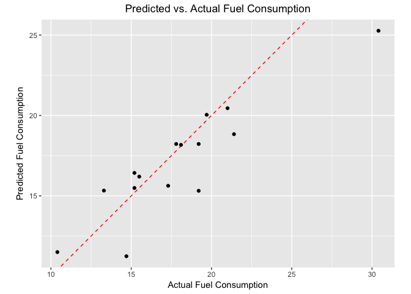

This is just a record of installing h2o and RSparkling. It recreates the installation instructions from [here](http://spark.rstudio.com/h2o.html) and fixes from [here](https://gist.github.com/edgararuiz/6453d44a91c85a87998cfeb0dfed9fa9) and [here](https://gist.github.com/JohnMount/bdfb47c2d02f96a4a36017c7e5ce2de6).

Install Spark and H20
---------------------

Trying h2o R package version 3.10.0.7 (H2O “Turing” release, build 7) and Spark 2.0.0. (Only need to run this block once)

``` r
# updated from https://gist.github.com/edgararuiz/6453d44a91c85a87998cfeb0dfed9fa9
# The following two commands remove any previously installed H2O packages for R.
if ("package:h2o" %in% search()) { detach("package:h2o", unload=TRUE) }
if ("h2o" %in% rownames(installed.packages())) { remove.packages("h2o") }

# Next, we download packages that H2O depends on.
pkgs <- c("methods","statmod","stats","graphics","RCurl","jsonlite","tools","utils")
for (pkg in pkgs) {
  if (! (pkg %in% rownames(installed.packages()))) { install.packages(pkg) }
}

# Now we download, install and initialize the H2O package for R.
install.packages("h2o", type = "source", repos = "http://h2o-release.s3.amazonaws.com/h2o/rel-turnbull/2/R")

# Installing 'rsparkling' from CRAN
install.packages("rsparkling")
options(rsparkling.sparklingwater.version = "2.0.3")
# Reinstalling 'sparklyr' 
install.packages("sparklyr")
sparklyr::spark_install(version = "2.0.0")
```

Try an example.

``` r
options(rsparkling.sparklingwater.version = "2.0.3")
library("rsparkling") 
library("sparklyr")

# start up Spark
sc <- spark_connect(master = "local", version =  "2.0.0")

# start up h2o, and tell it where Spark is
h2ocontext <- h2o_context(sc)

library("dplyr")
```

    ## 
    ## Attaching package: 'dplyr'

    ## The following objects are masked from 'package:stats':
    ## 
    ##     filter, lag

    ## The following objects are masked from 'package:base':
    ## 
    ##     intersect, setdiff, setequal, union

``` r
library("ggplot2")

mtcars_tbl <- copy_to(sc, mtcars, overwrite = TRUE)
mtcars_tbl
```

    ## Source:   query [32 x 11]
    ## Database: spark connection master=local[4] app=sparklyr local=TRUE
    ## 
    ##      mpg   cyl  disp    hp  drat    wt  qsec    vs    am  gear  carb
    ##    <dbl> <dbl> <dbl> <dbl> <dbl> <dbl> <dbl> <dbl> <dbl> <dbl> <dbl>
    ## 1   21.0     6 160.0   110  3.90 2.620 16.46     0     1     4     4
    ## 2   21.0     6 160.0   110  3.90 2.875 17.02     0     1     4     4
    ## 3   22.8     4 108.0    93  3.85 2.320 18.61     1     1     4     1
    ## 4   21.4     6 258.0   110  3.08 3.215 19.44     1     0     3     1
    ## 5   18.7     8 360.0   175  3.15 3.440 17.02     0     0     3     2
    ## 6   18.1     6 225.0   105  2.76 3.460 20.22     1     0     3     1
    ## 7   14.3     8 360.0   245  3.21 3.570 15.84     0     0     3     4
    ## 8   24.4     4 146.7    62  3.69 3.190 20.00     1     0     4     2
    ## 9   22.8     4 140.8    95  3.92 3.150 22.90     1     0     4     2
    ## 10  19.2     6 167.6   123  3.92 3.440 18.30     1     0     4     4
    ## # ... with 22 more rows

``` r
# transform our data set, and then partition into 'training', 'test'
partitions <- mtcars_tbl %>%
  filter(hp >= 100) %>%
  mutate(cyl8 = cyl == 8) %>%
  sdf_partition(training = 0.5, test = 0.5, seed = 1099)

library("h2o")
```

    ## 
    ## ----------------------------------------------------------------------
    ## 
    ## Your next step is to start H2O:
    ##     > h2o.init()
    ## 
    ## For H2O package documentation, ask for help:
    ##     > ??h2o
    ## 
    ## After starting H2O, you can use the Web UI at http://localhost:54321
    ## For more information visit http://docs.h2o.ai
    ## 
    ## ----------------------------------------------------------------------

    ## 
    ## Attaching package: 'h2o'

    ## The following objects are masked from 'package:stats':
    ## 
    ##     cor, sd, var

    ## The following objects are masked from 'package:base':
    ## 
    ##     &&, %*%, %in%, ||, apply, as.factor, as.numeric, colnames,
    ##     colnames<-, ifelse, is.character, is.factor, is.numeric, log,
    ##     log10, log1p, log2, round, signif, trunc

``` r
# h2ohandle <- h2o.init() # context probably does this under the covers
```

Now, let’s perform some simple transformations – we’ll

    Remove all cars with horsepower less than 100,
    Produce a column encoding whether a car has 8 cylinders or not,
    Partition the data into separate training and test data sets,
    Fit a model to our training data set,
    Evaluate our predictive performance on our test dataset.

The `sdf_partition` call is worth calling out (maybe in the slides, in the appropriate place). It splits the remote data into separate (remote) tables and returns a list of pointers, labeled by the partition labels.

``` r
# transform our data set, and then partition into 'training', 'test'
partitions <- mtcars_tbl %>%
  filter(hp >= 100) %>%
  mutate(cyl8 = cyl == 8) %>%
  sdf_partition(training = 0.5, test = 0.5, seed = 1099)
```

Now, we convert our training and test sets into H2O Frames using rsparkling conversion functions. We have already split the data into training and test frames using dplyr.

``` r
training <- as_h2o_frame(sc, partitions$training)
test <- as_h2o_frame(sc, partitions$test)
```

Alternatively, we can use the `h2o.splitFrame()` function instead of `sdf_partition()` to partition the data within H2O instead of Spark (e.g. `partitions <- h2o.splitFrame(as_h2o_frame(mtcars_tbl), 0.5)`)

``` r
# fit a linear model to the training dataset
glm_model <- h2o.glm(x = c("wt", "cyl"), 
                     y = "mpg", 
                     training_frame = training,
                     lambda_search = TRUE)
```

    ## 
      |                                                                       
      |                                                                 |   0%
      |                                                                       
      |=================================================================| 100%

For linear regression models produced by H2O, we can use either print() or summary() to learn a bit more about the quality of our fit. The summary() method returns some extra information about scoring history and variable importance.

``` r
print(glm_model)
```

    ## Model Details:
    ## ==============
    ## 
    ## H2ORegressionModel: glm
    ## Model ID:  GLM_model_R_1490281791570_1 
    ## GLM Model: summary
    ##     family     link                               regularization
    ## 1 gaussian identity Elastic Net (alpha = 0.5, lambda = 0.05468 )
    ##                                                                 lambda_search
    ## 1 nlambda = 100, lambda.max = 5.4682, lambda.min = 0.05468, lambda.1se = -1.0
    ##   number_of_predictors_total number_of_active_predictors
    ## 1                          2                           2
    ##   number_of_iterations                                training_frame
    ## 1                    0 frame_rdd_54_8a9fd012f386a14aaf6967563f3544bb
    ## 
    ## Coefficients: glm coefficients
    ##       names coefficients standardized_coefficients
    ## 1 Intercept    32.997281                 16.625000
    ## 2       cyl    -0.906688                 -1.349195
    ## 3        wt    -2.712562                 -2.282649
    ## 
    ## H2ORegressionMetrics: glm
    ## ** Reported on training data. **
    ## 
    ## MSE:  2.03293
    ## RMSE:  1.425808
    ## MAE:  1.306314
    ## RMSLE:  0.08238032
    ## Mean Residual Deviance :  2.03293
    ## R^2 :  0.8265696
    ## Null Deviance :93.775
    ## Null D.o.F. :7
    ## Residual Deviance :16.26344
    ## Residual D.o.F. :5
    ## AIC :36.37884

The output suggests that our model is a fairly good fit, and that both a cars weight, as well as the number of cylinders in its engine, will be powerful predictors of its average fuel consumption. (The model suggests that, on average, heavier cars consume more fuel.)

Let’s use our H2O model fit to predict the average fuel consumption on our test data set, and compare the predicted response with the true measured fuel consumption. We’ll build a simple ggplot2 plot that will allow us to inspect the quality of our predictions.

``` r
# compute predicted values on our test dataset
pred <- h2o.predict(glm_model, newdata = test)
```

    ## 
      |                                                                       
      |                                                                 |   0%
      |                                                                       
      |=================================================================| 100%

``` r
class(pred)
```

    ## [1] "H2OFrame"

``` r
# convert from H2O Frame to Spark DataFrame
predicted <- as_spark_dataframe(sc, pred)
class(predicted)
```

    ## [1] "tbl_spark" "tbl_sql"   "tbl_lazy"  "tbl"

``` r
# extract the true 'mpg' values from our test dataset
actual <- partitions$test %>%
  select(mpg) %>%
  collect() %>%
  `[[`("mpg")
class(actual)
```

    ## [1] "numeric"

``` r
# produce a data.frame housing our predicted + actual 'mpg' values
# notice we don't want to assign data.frame (or things to convert to them)
# directly as they land with their own column names.
data <- data.frame(
  predicted = sdf_read_column(predicted,'predict'),
  actual    = actual
)
str(data)
```

    ## 'data.frame':    15 obs. of  2 variables:
    ##  $ predicted: num  11.5 15.3 11.2 15.5 16.4 ...
    ##  $ actual   : num  10.4 13.3 14.7 15.2 15.2 15.5 17.3 17.8 18.1 19.2 ...

``` r
# plot predicted vs. actual values
ggplot(data, aes(x = actual, y = predicted)) +
  geom_abline(lty = "dashed", col = "red") +
  geom_point() +
  theme(plot.title = element_text(hjust = 0.5)) +
  coord_fixed(ratio = 1) +
  labs(
    x = "Actual Fuel Consumption",
    y = "Predicted Fuel Consumption",
    title = "Predicted vs. Actual Fuel Consumption"
  )
```



``` r
spark_disconnect_all()
```

    ## [1] 1

``` r
rm(list=ls())
gc()
```

    ##          used (Mb) gc trigger (Mb) max used (Mb)
    ## Ncells 738618 39.5    1168576 62.5  1168576 62.5
    ## Vcells 852459  6.6    1650153 12.6  1147297  8.8
